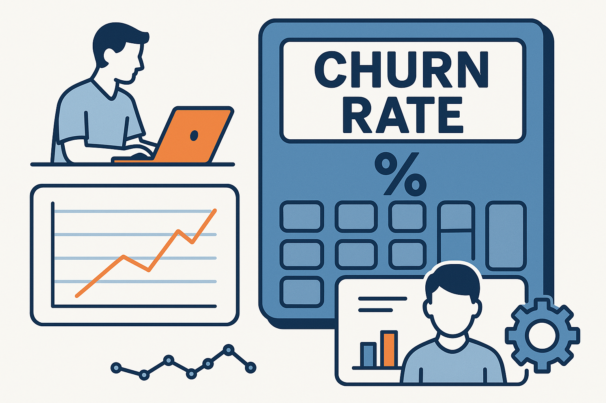

# Churn Rate Calculator



Questa repository contiene script Python per calcolare e prevedere il churn rate per un'azienda di energia e gas. Il progetto è evoluto da una semplice analisi statistica a un sistema predittivo avanzato basato su Machine Learning.

## Script Principali

### 1. churn_calculator.py (Versione Base)
Uno script semplice che calcola il churn rate tradizionale basato sullo stato attuale dei clienti.

**Funzionalità:**
- Calcola il churn rate totale: (Numero di Clienti Persi / Numero Totale di Clienti) * 100
- Utilizza dati minimi sui clienti (solo `customer_id` e `status`)

### 2. churn_calculator_ml.py (Versione Avanzata)
Uno script avanzato che include calcoli temporali, analisi predittiva con machine learning e visualizzazione dei trend. Questo è il cuore del progetto.

**Funzionalità Avanzate:**
- Calcola churn rate mensile e trimestrale
- Predice i clienti con alta probabilità di churn usando machine learning
  - Modelli supportati: `RandomForestClassifier`, `XGBClassifier`, `LogisticRegression`
  - Modello `RandomForestClassifier` ottimizzato con `GridSearchCV`
  - Gestione intelligente del bilanciamento delle classi
  - Feature engineering avanzato
- Confronta le performance di diversi modelli ML
- Analizza pattern e trend del churn
- Genera grafici per la visualizzazione dei dati
- Fornisce report dettagliati sulle performance del modello ML
- Esclude automaticamente i clienti che hanno già abbandonato dall'elenco delle predizioni

## Dataset

Il progetto include diversi dataset per diversi scopi:

- **`sample_customer_data.csv`**: File di esempio minimale per la versione base.
- **`customer_data.csv`**: File di esempio standard per la versione avanzata.
- **`customer_data_large.csv`**: Dataset sintetico più grande generato per test di carico.
- **`customer_data_enriched.csv`**: Dataset avanzato con caratteristiche aggiuntive (consumo, contatti con il supporto) che ha permesso di raggiungere performance eccellenti.
- **`customer_data_advanced.csv`**: Nuovo dataset avanzato con caratteristiche simulate.

Sono inclusi anche script per generare dataset sintetici:
- **`generate_large_customer_data.py`**: Crea un dataset di grandi dimensioni.
- **`generate_enriched_customer_data.py`**: Crea un dataset con caratteristiche avanzate.
- **`generate_advanced_customer_data.py`**: Crea un dataset con caratteristiche avanzate simulate.

## Requisiti

- Python 3.7+
- Librerie Python (vedi `requirements.txt`):
  - `pandas`
  - `numpy`
  - `scikit-learn`
  - `matplotlib`
  - `seaborn`
  - `xgboost`

## Installazione

1. Clona o scarica questa repository.
2. Installa i pacchetti richiesti:
   ```bash
   pip install -r requirements.txt
   ```

## Utilizzo

### Versione Base (churn_calculator.py)

1. Prepara i dati dei clienti in un file CSV con queste colonne:
   - `customer_id`: Identificativo univoco del cliente
   - `status`: Stato del cliente ('churned' o 'active')

2. Esegui lo script:
   ```bash
   python churn_calculator.py
   ```

3. Quando richiesto, inserisci il percorso del tuo file CSV.

### Versione Avanzata (churn_calculator_ml.py)

1. Prepara i dati dei clienti in un file CSV con queste colonne (quelle base sono sufficienti, altre sono opzionali e miglioreranno le predizioni):
   - `customer_id`: Identificativo univoco del cliente
   - `contract_start_date`: Data di inizio contratto (YYYY-MM-DD)
   - `contract_end_date`: Data di fine contratto (YYYY-MM-DD), vuoto se ancora attivo
   - `monthly_charges`: Addebiti mensili del cliente
   - `total_charges`: Addebiti totali del cliente
   - `payment_method`: Metodo di pagamento utilizzato dal cliente
   - `tenure_months`: Numero di mesi di fidelizzazione del cliente
   - `service_type`: Tipo di servizio (electricity, gas, both)
   - `contract_type`: Tipo di contratto (month-to-month, one year, two year)
   - `avg_monthly_consumption_kwh` (opzionale): Consumo medio mensile in Kwh
   - `num_support_contacts_last_year` (opzionale): Contatti con il supporto nell'ultimo anno

2. Esegui lo script:
   ```bash
   python churn_calculator_ml.py [percorso_file_csv] [anno] [modello]
   ```
   
   Tutti i parametri sono opzionali:
   - `percorso_file_csv`: Percorso al file CSV con i dati dei clienti
   - `anno`: Anno per l'analisi (es. 2023)
   - `modello`: Modello ML da utilizzare (`random_forest`, `xgboost`, `logistic_regression`)

3. Se non forniti, lo script chiederà di inserire questi valori interattivamente.

### Generazione di Dataset Sintetici

Per generare nuovi dataset per il testing:

- Per un dataset più grande:
  ```bash
  python generate_large_customer_data.py
  ```
- Per un dataset arricchito:
  ```bash
  python generate_enriched_customer_data.py
  ```
- Per un dataset avanzato:
  ```bash
  python generate_advanced_customer_data.py
  ```

## Performance del Modello

L'attuale implementazione di `churn_calculator_ml.py` offre performance eccellenti grazie all'integrazione di dati contestuali:

- **Accuratezza**: 98%
- **Precisione per i clienti che abbandonano**: 100%
- **Richiamo (Recall) per i clienti che abbandonano**: 89%

La caratteristica più predittiva identificata è il **numero di contatti con il supporto nell'ultimo anno**.

## Documentazione

Per ulteriori dettagli sul funzionamento interno del modello e sullo stato del progetto, consulta i seguenti documenti:

- **`MODELLO_DECISIONALE.md`**: Descrizione dettagliata del modello di machine learning, delle sue caratteristiche e di come prende le decisioni.
- **`RIASSUNTO_PROGETTO.md`**: Panoramica completa dello stato del progetto, del piano di miglioramento seguito e delle future direzioni.
- **`QWEN.md`**: Guida operativa per lo sviluppo e la manutenzione del progetto.

## Sviluppo Futuro

Il progetto è in continua evoluzione. Le prossime tappe includono:
- Integrazione e confronto con altri modelli di machine learning (XGBoost, LogisticRegression).
- Definizione di un piano per integrare dati aziendali reali.
- Creazione di un'interfaccia utente o di un'API per facilitare l'utilizzo.